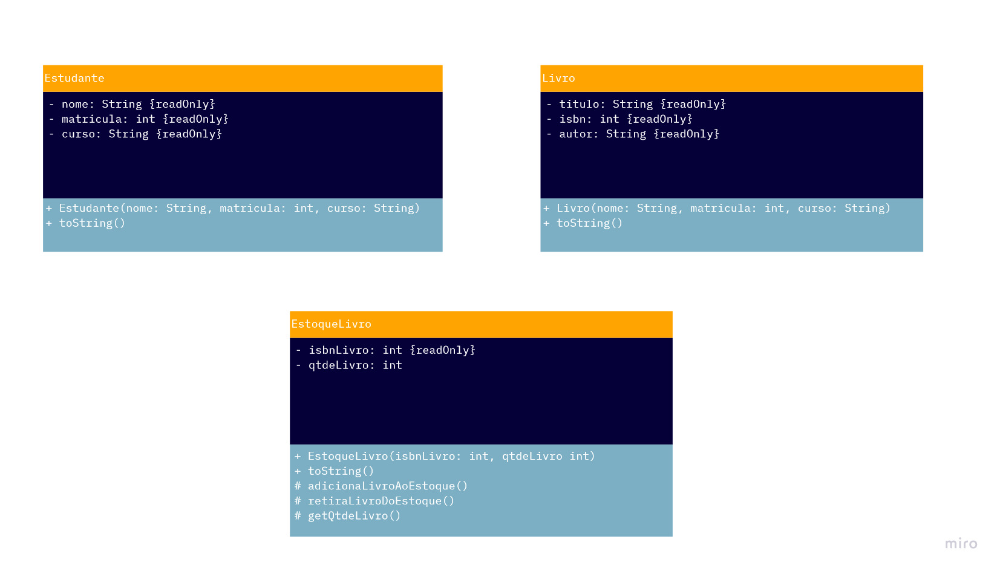
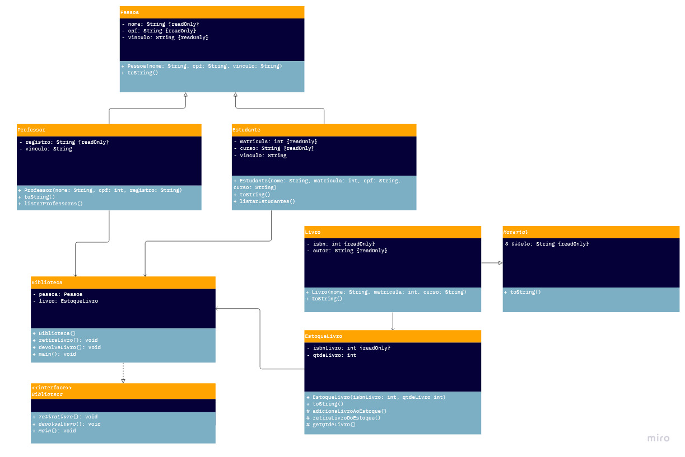

# BiblioSystem

- Universidade: PUC-PR
- Disciplina: Fundamentos da Programação Orientada a Objetos
- Programa de Monitoria
- Desenvolvimento de sistema em Java para fins de estudo acadêmico

# Descrição do Produto

Programa para retirada e devolução de livros de uma biblioteca.

# Requisitos Funcionais

- Cadastro de estudantes. 
  - Listagem, detalhes, criação, edição e remoção dos estudantes. 

- Cadastro de livros. 
  - Listagem, detalhes, criação, edição e remoção dos livros. 

- Estoque de livros: 
  - Listagem, detalhes entrada, retirada, remoção. 

- Movimentação de livros. 
  - Retirada de um livro. 
  - Devolução de um livro.

- Validações, persistência, interface gráfica 

- Busca de estudantes, de livros, de estoque 

- ### Alteração nos requisitos:
  - Cadastro de professores
  - Professores também poderão retirar livros

# MVP: 

- Cadastro de estudantes. 
  - Criação e listagem dos estudantes.

- Cadastro de professores.
  - Criação e listagem dos professores.  
  
- Cadastro de livros. 
  - Criação e listagem dos livros. 
  
- Estoque de livros: 
  - Entrada e listagem dos livros. 
  
- Movimentação de livros. 
  - Retirada de livros pelos estudantes ou professores. 
  - Devolução de livros pelos estudantes ou professores. 
  
- Validações, persistência, interface gráfica 
- Busca de estudantes, de livros, de estoque 
- Validações, persistência, interface gráfica 

# Modelagem UML

### Versão 1:

### Versão 2:

